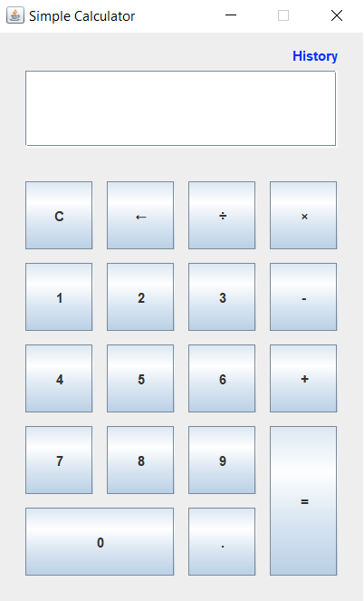
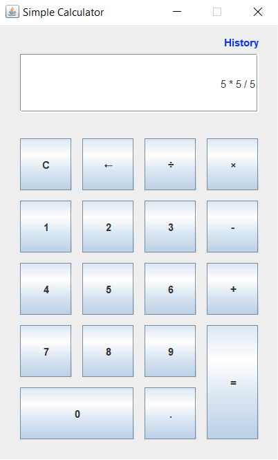
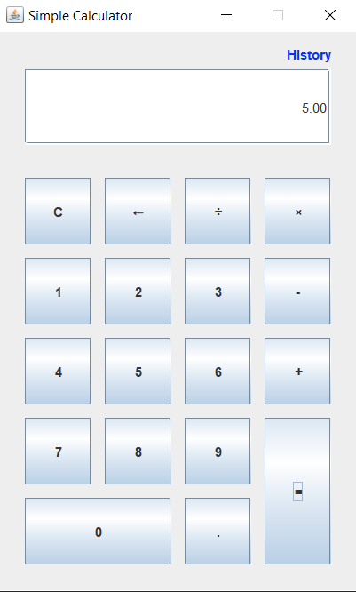
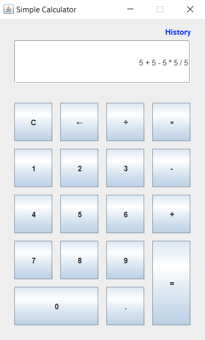
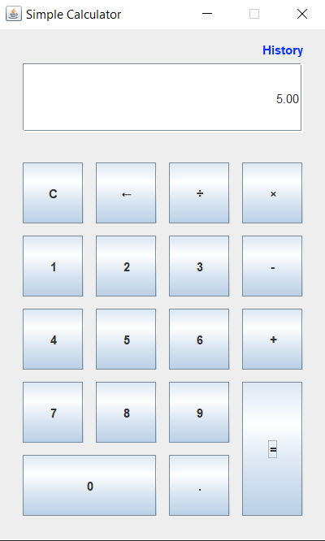
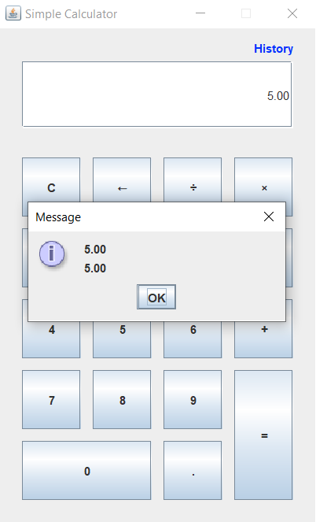

# BODMAS Calculator

This is a Java Swing-based calculator that does calculations using the BODMAS rule. It not only performs the calculation, but it also saves the result's history so that it can be reviewed later if necessary.

## Screenshots

-   Front Page
      

-   Calculation 1
      
 

-   Calculation 2
      
 

-   History
      

## Proposed Solution

-   Use space to separate each operator and operand.
-   Turn the infix expression into a postfix expression.
-   Evaluate the expression.
-   Save the result it in the history.

## Prerequisite

-   Java 8 or higher
-   IntelliJ IDEA / Apache NetBeans / Eclipse

## Running the project

-   Clone the repository

    `git clone https://github.com/ayxsth/RailGate.git`

-   Open the IDE

-   Go to the Open Project section

-   Run the project
